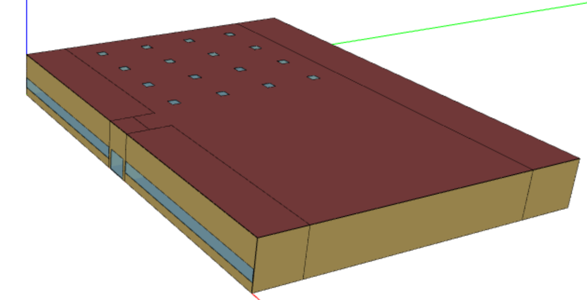

# Building Description

The Building we will be creating is based on the building generated by running an OpenStudio -> Create DOE Prototype Building measure.  It has the following characteristics:

| Building Name | PSZ Test 1 |
|-----------------|---------------------------------------------------------------------------------------------------------------------------------------------------------------------------------------------------------------------|
| Location | Chicago |
| Climate Zone | 5A |
| Description | PSZ System |
| Standard | ASHRAE 90.1 |
| Year | 2013 |
| Building Type | Retail |
| Potential Model | RetailStandalone Prototype |
| Floor Area | 24,695 |
| Stories | 1 |
| Zones | 5.  The Front_Entry Zn is heating only (129 sf), all else heating and cooling |
| Heating | Natural gas furnace heating, 80% efficiency. |
| Cooling | 2 speed DX cooling, 11.0 EER |
| Fan | Constant Volume Scheduled on.  M-F, 6am-21.  Sat, 6am-22 |

The building looks as follows:

# Select the Type of HVACSystem